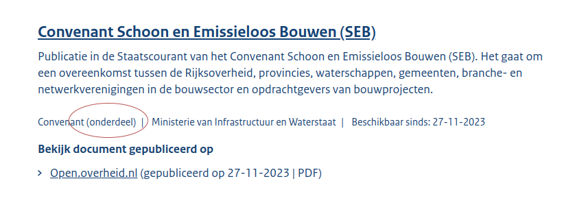
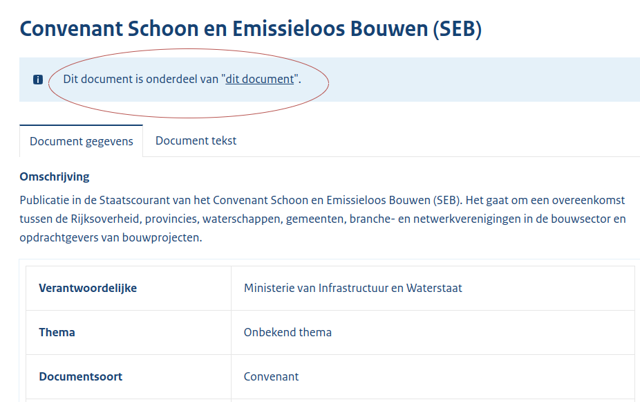

# 2f - Convenanten

## Overzicht scrapers
- [Open overheid](https://open.overheid.nl/)
- [OpenWoo](https://openwoo.app/)

[Hier](../SPEC%20MetadataSchema/README.md) zijn alle metadata velden te vinden die we (indien beschikbaar) opslaan.

## Open overheid

Scraper source op [Github](https://github.com/wooverheid/WooScrapers/blob/main/Spiders/SpiderOpenOverheid.py).

### Dagelijks
Dagelijks halen we alle convenanten op via de link: https://open.overheid.nl/zoekresultaten?informatiesoort=c_386e74cb door middel van een webscraper. In deze lijst worden ook onderdelen (= losse documenten) van Woo-dossiers opgenomen. Om dubbelen te voorkomen worden deze gefilterd door:

- In de lijst te kijken of het type document 'Convenant (onderdeel)' is:

- Op de pagina zelf te kijken of er wordt gelinkt naar een ander document:

De convenanten en documenten worden bij ons geupload als ze geen bekende URL hebben. Dit betekent ook dat wijzigingen achteraf in bij ons bekende convenanten **niet** worden doorgevoerd. Ook worden ze niet verwijderd als ze niet meer op de bron website staan.

## OpenWoo

Scraper source op [Github](https://github.com/wooverheid/WooScrapers/blob/main/Spiders/SpiderOpenWoo.py).

### Dagelijks
Dagelijks worden alle publicaties opgehaald door middel van de API van OpenWoo. Deze worden verwerkt en omgeschreven naar voor ons relevante metadata. De URL naar deze API is: https://api.common-gateway.commonground.nu/api/publicaties. Publicaties zonder bron url (`portalUrl` in de API) worden overgeslagen. Geselecteerde dossiers hebben als `categorie` 'Convenant' in de API.

De convenanten en documenten worden bij ons geupload als ze geen bekende URL hebben. Dit betekent ook dat wijzigingen achteraf in bij ons bekende convenanten **niet** worden doorgevoerd. Ook worden ze niet verwijderd als ze niet meer op de bron website staan.