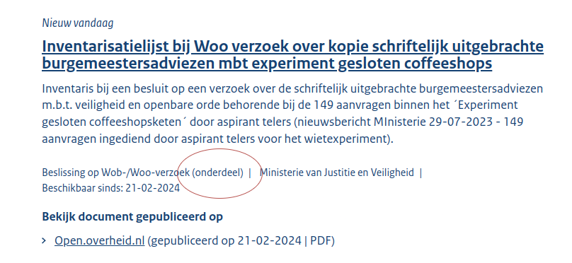
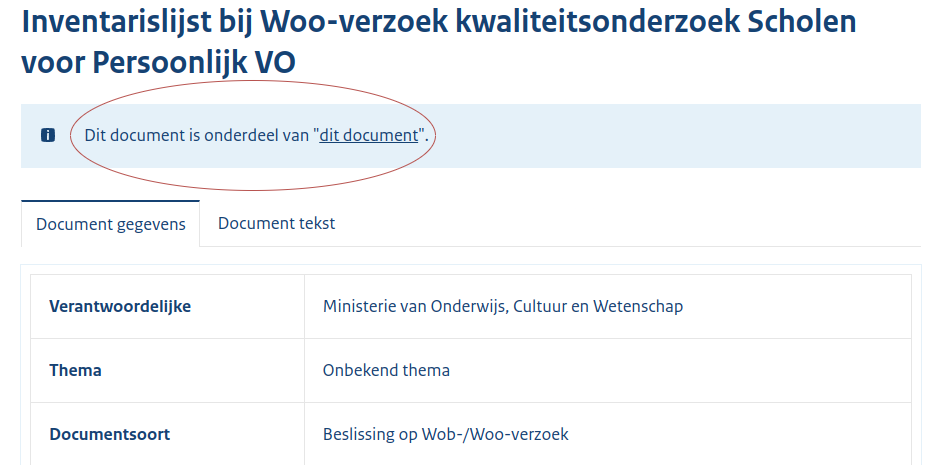

# Scrapers 2i - Beslissingen op Woo/Wob verzoeken

## Overzicht scrapers
- [Open overheid](https://open.overheid.nl/)
- [OpenWoo](https://openwoo.app/)
- [Gemeente Den Haag](https://denhaag.nl/)
- [Gemeente Dordrecht](https://www.dordrecht.nl/)
- [Tweede Kamer](https://www.tweedekamer.nl/)
- [Gemeente Utrecht](https://www.utrecht.nl/) (momenteel uitgeschakeld)
- [Rijkswaterstaat](https://www.open.rijkswaterstaat.nl/)

[Hier](../SPEC%20MetadataSchema/README.md) zijn alle metadata velden te vinden die we (indien beschikbaar) opslaan.

## Open overheid

Scraper source op [Github](https://github.com/wooverheid/WooScrapers/blob/main/Spiders/SpiderOpenOverheid.py).

### Dagelijks
Dagelijks halen we alle Woo-dossiers op van het afgelopen jaar via de link: https://open.overheid.nl/zoekresultaten?datumrange=afgelopen-jaar&informatiesoort=c_4f50ca9c door middel van een webscraper. In deze lijst worden ook onderdelen (= losse documenten) van Woo-dossiers opgenomen. Om dubbelen te voorkomen worden deze gefilterd door:

- In de lijst te kijken of het type document 'Beslissing op Wob-/Woo-verzoek (onderdeel)' is:

- Op de pagina zelf te kijken of er wordt gelinkt naar een ander document:

De dossiers en documenten worden bij ons geupload als ze geen bekende URL hebben. Dit betekent ook dat wijzigingen achteraf in bij ons bekende dossiers **niet** worden doorgevoerd. Ook worden ze niet verwijderd als ze niet meer op de bron website staan.

### Wekelijks
Wekelijks halen we alle Woo-dossiers op van alle jaren via de link: https://open.overheid.nl/zoekresultaten?informatiesoort=c_4f50ca9c door middel van een webscraper. Op deze manier hopen we ook later geplaatste documenten op te vangen. De verwerking is identiek aan de dagelijkse verwerking.

## OpenWoo

Scraper source op [Github](https://github.com/wooverheid/WooScrapers/blob/main/Spiders/SpiderOpenWoo.py).

### Dagelijks
Dagelijks worden alle publicaties opgehaald door middel van de API van OpenWoo. Deze worden verwerkt en omgeschreven naar voor ons relevante metadata. De URL naar deze API is: https://api.common-gateway.commonground.nu/api/publicaties. Publicaties zonder bron url (`portalUrl` in de API) worden overgeslagen. Geselecteerde dossiers hebben als `categorie` 'Woo verzoek' in de API.

De dossiers en documenten worden bij ons geupload als ze geen bekende URL hebben. Dit betekent ook dat wijzigingen achteraf in bij ons bekende dossiers **niet** worden doorgevoerd. Ook worden ze niet verwijderd als ze niet meer op de bron website staan.

## Gemeente Den Haag

Scraper source op [Github](https://github.com/wooverheid/WooScrapers/blob/main/Spiders/SpiderDenHaag.py).

### Dagelijks
Dagelijks worden alle publicaties opgehaald van de website van de gemeente Den Haag. Dit gebeurt door middel van een webscraper. De URL naar deze pagina is: https://woo.denhaag.nl/wob-besluiten/. 

De dossiers en documenten worden bij ons geupload als ze geen bekende URL hebben. Dit betekent ook dat wijzigingen achteraf in bij ons bekende dossiers **niet** worden doorgevoerd. Ook worden ze niet verwijderd als ze niet meer op de bron website staan.

## Tweede Kamer

Scraper source op [Github](https://github.com/wooverheid/WooScrapers/blob/main/Spiders/SpiderTweedeKamer.py).

### Dagelijks
Dagelijks worden alle publicaties opgehaald van de website van de Tweede Kamer. Dit gebeurt door middel van een webscraper. De URL naar deze pagina is: https://www.tweedekamer.nl/contact-en-bezoek/wet-open-overheid-woo/woo-besluiten.

De dossiers en documenten worden bij ons geupload als ze geen bekende URL hebben. Dit betekent ook dat wijzigingen achteraf in bij ons bekende dossiers **niet** worden doorgevoerd. Ook worden ze niet verwijderd als ze niet meer op de bron website staan.

## Gemeente Dordrecht

Scraper source op [Github](https://github.com/wooverheid/WooScrapers/blob/main/Spiders/SpiderDordrecht.py).

### Dagelijks
Dagelijks worden alle publicaties opgehaald van de website van de gemeente Dordrecht. Dit gebeurt door middel van een webscraper. De URL naar deze pagina is: https://cms.dordrecht.nl/Inwoners/Overzicht_Inwoners/Wet_open_overheid/Afgehandelde_Woo_verzoeken. 

De dossiers en documenten worden bij ons geupload als ze geen bekende URL hebben. Dit betekent ook dat wijzigingen achteraf in bij ons bekende dossiers **niet** worden doorgevoerd. Ook worden ze niet verwijderd als ze niet meer op de bron website staan.

## Rijkswaterstaat

Scraper source op [Github](https://github.com/wooverheid/WooScrapers/blob/main/Spiders/SpiderRijkswaterstaat.py).

### Dagelijks
Dagelijks worden alle publicaties opgehaald van de website van Rijkswaterstaat. Dit gebeurt door middel van een webscraper. De URL naar deze pagina is: https://open.rijkswaterstaat.nl/open-overheid/woo-verzoeken/. 

De dossiers en documenten worden bij ons geupload als ze geen bekende URL hebben. Dit betekent ook dat wijzigingen achteraf in bij ons bekende dossiers **niet** worden doorgevoerd. Ook worden ze niet verwijderd als ze niet meer op de bron website staan.